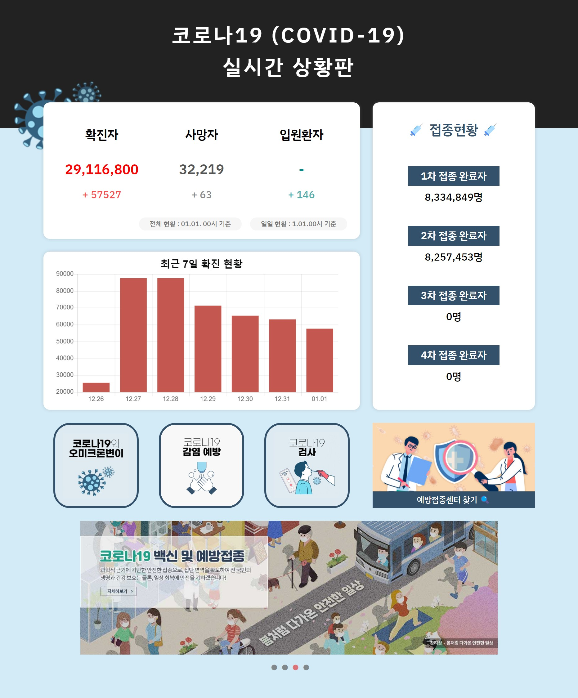
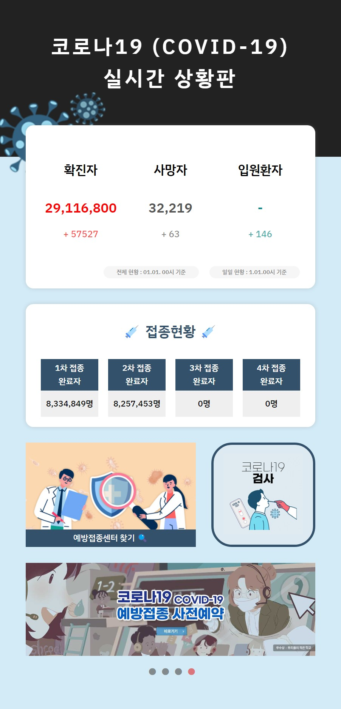
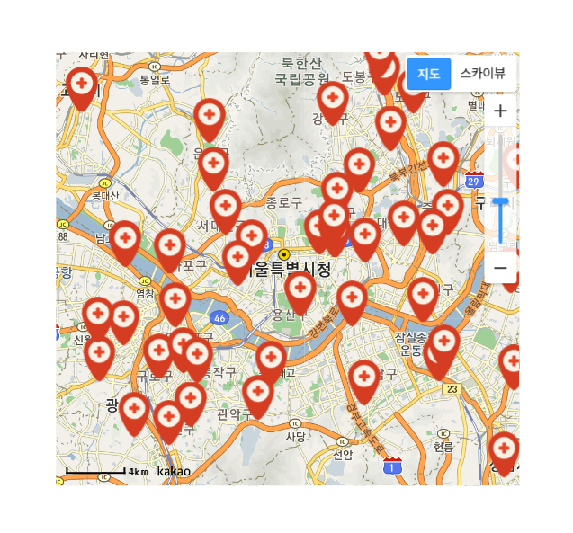
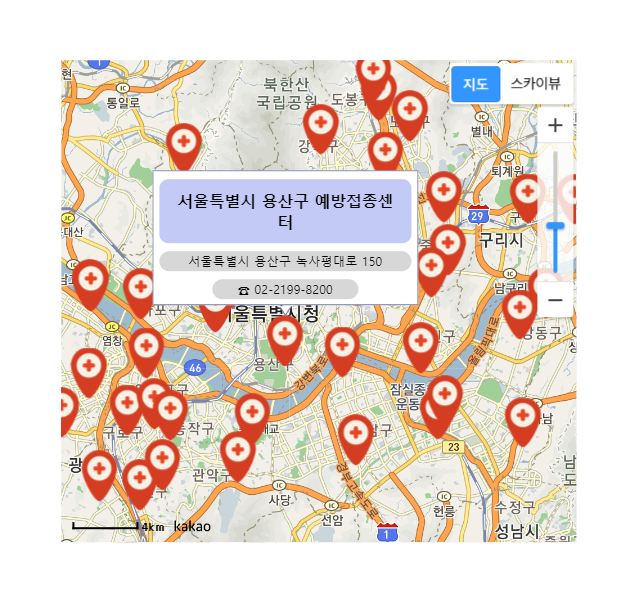

<h1>COVID19</h1>

SeSAC의 JavaScript 수업을 바탕으로 개발한 COVID-19 프로젝트입니다.

코로나 현황 정보와 예방접종 센터의 위치를 조회할 수 있는 사이트입니다.

[예방접종센터 찾기] 클릭 시 지도 팝업이 나타납니다

🔗 배포 URL : <a href='https://sesac-c1a13.web.app/'> COVID 19</a>

배포 후 오류가 많아 수정중입니다

 
 

  
  
MAIN 페이지

   
  
  
반응형

   
  
  
지도 팝업

   
  
  
지도 팝업 마커의 툴팁

   

 
 

## 작업 기간

2022.11.16 ~ 2022.11.22
 
 

## 기술 스택

    
 
 

## 구현 기능

- fetch로 api 데이터 받아오기
- map 함수를 활용하여 원하는 데이터 출력
- SlickSlider 라이브러리를 통한 슬라이드 배너 제작
- 미디어쿼리를 사용한 반응형 페이지 제작
- animation을 활용한 좌측상단 이미지 동적효과
- CSS를 통한 스타일링
   
